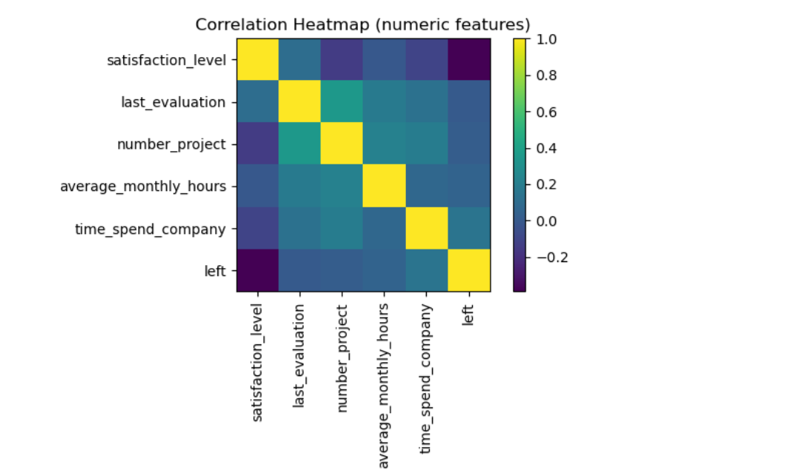

# 🧠 HR Retention Prediction (Data Science Project)

This project predicts employee attrition using machine learning in Python.

## 🔍 Overview
- Uses HR employee dataset (15,000 records)
- Compares Logistic Regression, Decision Tree, and Random Forest models
- Random Forest achieved the best performance (~98% accuracy)

## 🧰 Tools
- Python (pandas, numpy, matplotlib, seaborn, scikit-learn)
- Jupyter Notebook (Anaconda)
- Visualisations exported to `images/` folder

## 📊 Key Visuals

## 🏁 Results
| Model | Accuracy | Precision | Recall | F1 |
|--------|-----------|------------|--------|----|
| RandomForest | 0.99 | 0.99 | 0.98 | 0.99 |
| DecisionTree | 0.98 | 0.97 | 0.98 | 0.98 |
| LogisticRegression | 0.76 | 0.82 | 0.75 | 0.77 |

## 📖 How to Run
1. Open `HR_Retention.ipynb` in Jupyter Notebook or VS Code  
2. Update dataset path if needed  
3. Run cells sequentially  

## 👤 Author
Jack Morrison — Data Science Portfolio
